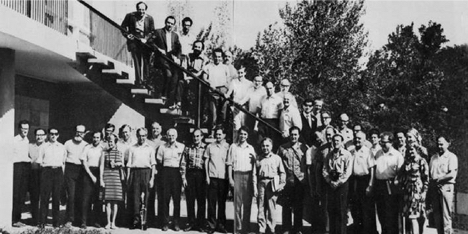
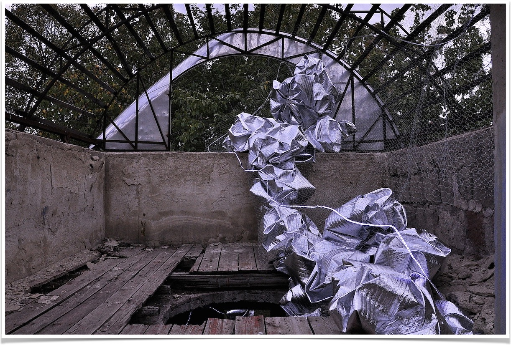

# HAYP POP UP GALLERY

## CETI LAB: ARTICULATING FRAMEWORKS FOR COMMUNICATION

September 21, 2017

by Anna K. Gargarian, Curator “CETI Lab”

September 2017 is an important marker in the history of space exploration: exactly forty years since the Voyager 1 was sent into space, forty-six years since a group of nobel prize winning scientists gathered at Byurakan to discuss communicating with extraterrestrial intelligence (CETI), and seventy years since Victor Ambartsumian discovered stellar associations.
Ambartsumian’s breakthrough transformed our understanding of the life of stars, and marked the beginning of the intellectual community that is the Byurakan Astrophysical Observatory (BAO). It was Ambartsumian’s reputation, in combination with the unique environment of BAO, that lead scientists Carl Sagan and I.E. Shklovskii to propose Byurakan as the location for the 1971 CETI conference[^1]. During the peak of the cold war, scientists from the USSR and the US came together for four days to discuss the challenges of communicating with intelligent life beyond our planet. The conference addressed questions of language, knowledge representation, transmission, reception, as well as philosophical concerns of free will, perception, and the consequences of successful communication. The information gathered during this conference was part of Sagan and Shklovksii’s decade-long collaborative research that informed the content of space missions like the Pioneer 10 in 1972, and Voyagers 1 and 2 in 1977[^2].

The 1971 CETI conference participants standing in front of the Byurakan Astrophysical Observatory’s conference hall.

It is within this context that HAYP Pop Up Gallery exhibits “CETI Lab: HAYP at BAO”, a multi-location collective exhibit that invites artists and scientists to imagine communicating with extraterrestrial intelligence. From September 16-27, 2017, the Byurakan Astrophysical Observatory (BAO) and the Herouni Radio-Optic Telescope in Orgov, Armenia will be transformed with site-specific installations by a diverse group of artists.

Like the scientists before them, the artists are concerned with frameworks for representing, expressing, and accessing information. Contextualizing a question is at the heart of all problem-solving, whether from an epistemological[^3], scientific, or curatorial perspective. It is for this reason that the 1971 CETI conference organizers shaped their discussion around the Drake Equation, a proposed formula for estimating the likelihood of communicating civilizations beyond our planet. While the equation was criticized for being more conjectural than scientific, its concern was not with accuracy but rather offered a framework for structuring the conversation[^4]. Similarly, the exhibition does not present one unified perspective, but rather proposes a structured set of contexts for approaching the question of communication. Through this diverse net of projects by writers, musicians, sculptors, photographers, and architects, we intend to portray a feeling for the paradigm of communication through an expressive language that uses metaphor as a formalism for understanding[^5].

This brings us to our second concern, which is the question of language. Among the 1971 conference participants were linguists, anthropologists, and artificial intelligence experts who shared a common interest in finding the appropriate expressive language for representing cognitive theory. They discussed the possibilities of using binary, computer, or image-based languages, and struggled with the fact that language evokes ideas that extend beyond the subject at hand and refers to cultural perceptions that are not universal[^6]. Through metaphor, we hope to explore the conditions that frame communication and “help us understand references, reasons, motivation, and purpose not explicitly stated”[^7]. These conditions include self-consciousness, as seen in the installation by Sona Manukyan and the poetry of Arto Vaun. They include our awareness of our limitations in time and space as in the sculptural works of Manan Torosian and Samvel Saghatelian. In Vardan VHSound’s “Communication Machine”, the artist is concerned with representing not only knowledge, but also sensorial experience through an acoustic map of our environment. Artist Karen Mirzoyan explores the potentially dangerous consequences of successful communication through an apocalyptic “intergalactic war” series.

The exhibition is aware of the dangers of metaphor, which although a useful tool for understanding, is often scientifically inaccurate[^8]. But these inaccuracies, or rather absurdities of logic, are also at the core of this exhibition. Gaps in commonsense reasoning like trying to conceive of communicating with an “other” whose existence is still unknown, or like building a radio-optic telescope that was never actually used[^9]. Even sending devices into space as “time-capsules” of planet earth that may only reach another life-form long after human extinction on planet Earth. Science, like art, has been revolutionized by “absurd” ideas. While many of the exhibited works incorporate an element of humor, Lvis Mejía’s installation piece in Orgov subtly comments on the irony of a radio-optic telescope made to record sounds from space, by manipulating its shape in order to provide the observer with audio feedback defined by the observer him/herself.

Communication, like humor and the creative process, is ultimately born from a social context. Although there are great differences in the ways that artists and scientists approach universal concerns of existence, self-consciousness, and life beyond our planet, we hope to draw parallels on our collective interest for understanding and creatively manipulating our human limitations[^10].

While the Voyagers serve as interstellar time-capsules of human knowledge and culture, “CETI Lab: HAYP at BAO” has explored a much closer time-capsule which is the unique environment of the Byurakan Astrophysical Observatory. Like the scientists of the ’71 CETI conference, our ’17 CETI Lab artists have immersed themselves in the unique environment of the Byurakan Astrophysical Observatory in order to explore its culture, history, and the multi-layered dynamics of a still vibrant community of thinkers in order to address the underlying question:

> “Before we ask how aliens communicate, we ought to ask how humans can.” – Marvin Minsky[^11]

## The Artworks of “CETI Lab: HAYP at BAO”

Sona Manukyan, “Do they breathe?”. Photocredits: Zohrab Bauer

[^1]: According to Shklovskii, the original conference location was to be in Czechoslovakia, but this decision was changed after the tensions of the Warsaw Pact Invasion in 1968. Shklovskii states in his memoir that Byurakan seemed an opportune choice because of his ties to Ambartsumian and the “blinding beauty” (Ослепительная красота) of the view of Mount Ararat. (Шкловский, 110)
[^2]: From 1961 to 1967 Sagan and Shklovskii co-authored the book Intelligent Life in the Universe. The collaboration started as a translation exchange, in which Sagan translated from Shklovskii’s original text, but evolved into co-authorship as Sagan amended significant sections of the book. The book was fully written long distance via paper mail. Sagan and Shklovskii didn’t meet until the 1971 CETI conference in Byurakan, as Shklovskii wasn’t allowed to leave the USSR. (See Spangenburg, 68).
[^3]: The idea of “frameworks” was first developed by Minsky in 1975 within the artificial intelligence context as a way of conceiving of knowledge in structured units. Papert and Goldstein elaborated on frame theory in 1977 within the epistemological context to discuss “knowledge frameworks” as a theory on contexts, their relationship to language, and consequently understanding (Goldstein, 93-96).
[^4]: The Drake Equation was a probabilistic argument on the number of intelligent communicative civilizations beyond our planet. According to Sagan, the Drake equation was chosen for the conference structure (vs other equations on the same subject) because it was the original and simplest one (Каплана, 12)
[^5]: In Goldstein and Papert (1977) the authors speak of metaphor as a tool for “debugging” and self-learning. In the context of humor, Minsky (1980) sees metaphor as a powerful thought tool to apply previous knowledge and experience to new problems. Metaphor is essentially one of our most effective ways for representing and understanding the world around us.
[^6]: Goldstein & Papert, 96
[^7]: Goldstein & Papert, 101
[^8]: Minsky (1980)
[^9]: I am making reference to the Herouni Radio-Optic Telescope in Orgov, Armenia (one of the locations of our exhibit). Although the telescope was used for observing stars and planets, it never fulfilled its primary intended function: to capture radio signals from space. It is important to note that there is little objective research published about this telescope whose history, purpose, and engineering remains an interesting point for further research and development.
[^10]: For Mayakovsky, poetry (like all art) should be born from a “social command” (Mayakovsky, 18). There are interesting parallels between the creative process of Mayakovsky (as described in “How are verses made?”), and man’s challenge of communicating with extraterrestrial intelligence as defined by Minsky in his 1985 essay. Both identify material, space, and time as man’s constraints to be manipulated for effective understanding of our social environment and thinking processes.
[^11]: Minsky, 1985. p 9. It’s interesting to note that Ambartsumian makes a similar reference in the 1971 conference catalogue recalling: “Professor Shklovsky was right when he told me, before we can solve the problem of communicating with extraterrestrial civilizations, it would be nice to establish contact regarding this question with other countries, and that’s exactly the aim of this conference.” Paraphrased from Russian original text in Каплана, p11.

## Works Cited

* Goldstein, I. and Papert, S. (1977), Artificial Intelligence, Language, and the Study of Knowledge*,†. Cognitive Science, 1: 84–123. doi:10.1207/s15516709cog0101_5
* Mayakovsky, Vladimir. How are verses made?. Translation from original (1926). Cape ed., London, Grossman Publishers, 1970, reprinted 1974.
* Minsky, Marvin “Communication with Alien Intelligence.” Regis, Edward, ed. Extraterrestrials: Science and Alien Intelligence. Cambridge University Press, 1985.
* Minsky, Marvin, “Jokes and their Relation to the Cognitive Unconscious.” In Cognitive Constraints on Communication, Vaina and Hintikka (eds.) Reidel, 1981. A.I. memo NO: 603, November 1980. Accessed Aug 16 2017. <https://web.media.mit.edu/~minsky/papers/jokes.cognitive.txt>
* Minsky, Marvin “What to transmit, and what one might expect to receive” (notes, Byurakan, Armenia, Sept 7 1971), 1-11. Use courtesy of the Minsky Family.
* “NASA’s Voyager Spacecraft Still Reaching for the Stars After 40 Years.” NASA, NASA, 1 Aug. 2017, <http://www.nasa.gov/press-release/nasa-s-voyager-spacecraft-still-reaching-for-the-stars-after-40-years>. Accessed 3 Sept. 2017.
* Проблема CETI (связь с внеземными цивилизациями), ред. С.А. Каплана, – Издательство “Мир”, – Москва, 1975, 349 с.
* Spangenburg, Ray, and Diane Moser. Carl Sagan: a biography. Westport, CT, Greenwood Press, 2004.
* Шкловский И. С. Эшелон. Невыдуманные рассказы. — М.: «Новости», 1991. — 222 с.
